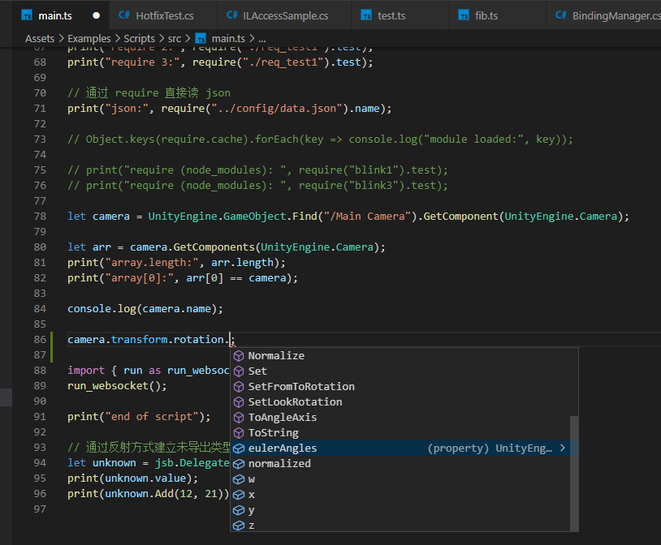

# unity-jsb

使用 [QuickJS](https://bellard.org/quickjs/) 为 Unity3D 项目提供 Javascript 运行时支持.<br/>
通过生成静态绑定代码的方式提供性能良好的 C#/JS 互操作支持. 支持移动平台. <br/>

> QuickJS is a small and embeddable Javascript engine. It supports the ES2020 specification including modules, asynchronous generators, proxies and BigInt. 

# 特性支持
* JS异步函数与 Unity 协程/ C# Tasking 的结合 (limited support)
* 支持运算符重载 +, -, *, /, ==, -(负)
* 支持 JS 字节码 (QuickJS)
* extends MonoBehaviour/EditorWindow/Editor in scripts
* [初步] 开发过程中无需生成绑定代码
* [初步] 支持 JS Worker (limited support)
* [初步] 支持未导出的C#类型的 JS 交互
* [初步] 支持 C# 代码热更 (hotfix, limited support)
* [初步] 编辑器执行 JS 脚本 (支持在脚本中写 EditorWindow, Editor 等)
* [未完成] Webpack HMR 运行时模块热替换 (limited support, for development only)

# 附加模块支持 (可选)
Extra 为可选附加模块, 提供不同的特定功能, 不需要的直接删除相应目录即可.
* Websocket (初步支持, limited support)
* XMLHttpRequest (初步支持, limited support)
* SourceMap (支持 stacktrace 转换)
* MiniConsole (演示了如何将日志转向界面)
* NodeCompatibleLayer (experimental)
* DOMCompatibleLayer (experimental)
* UdpSocket (未实现)
* SQLite (未实现)
* FairyGUI 接入示例 (with FairyGUI Editor plugin)

# 特性示例
> 推荐使用 typescript 编写脚本, unity-jsb 对导出的 C# 类型自动生成了对应的 d.ts 声明, 以提供强类型辅助. 示例代码均使用 typescript. 
>
> 也可以根据喜好选择 coffeescript/clojurescript 等任何可以编译成 javascript 的语言. 最终运行的都是 javascript.

## MonoBehaviour in Javascript
> 支持 JS class 直接继承 MonoBehaviour 
>
> 所有响应函数支持 JS 异步函数

```ts
// 导出到 JS 中的 C# 类型的命名空间将作为 JS 的模块名
// 通过 VSCode 等编辑器, 可以很方便地自动填写 import 语句
import { MonoBehaviour, WaitForSeconds, Object, GameObject } from "UnityEngine";

// 通过 @Inspector 可以指定由脚本实现的编辑器 (script implemented custom editor extends UnityEngine.Editor)
// 详见 example_monobehaviour.ts 例子
class MyClass extends MonoBehaviour {
    protected _tick = 0;

    Awake() {
        console.log("MyClass.Awake", this._tick++);
    }

    async OnEnable() {
        console.log("MyClass.OnEnable", this._tick++);
        await jsb.Yield(new WaitForSeconds(1));
        console.log("MyClass.OnEnable (delayed)", this._tick++);
    }

    OnDisable() {
        console.log("MyClass.OnDisable", this._tick++);
    }

    OnDestroy() {
        console.log("MyClass.OnDestroy", this._tick++);
    }

    async test() {
        console.log("MyClass.test (will be destroied after 5 secs.", this.transform);
        await jsb.Yield(new WaitForSeconds(5));
        Object.Destroy(this.gameObject);
    }
}

class MySubClass extends MyClass {
    Awake() {
        super.Awake();
        console.log("MySubClass.Awake", this._tick++);
    }

    play() {
        console.log("MySubClass.play");
    }
}

let gameObject = new GameObject();
let comp = gameObject.AddComponent(MySubClass);

comp.play();

let comp_bySuperClass = gameObject.GetComponent(MyClass);
comp_bySuperClass.test();
```

## 支持编辑器脚本
> 目前实现了在脚本中继承 EditorWindow (功能还在完善中).

```ts
import { EditorWindow } from "UnityEditor";
import { GUILayout, GUIContent } from "UnityEngine";

// @jsb.Shortcut("Window/JS/MyEditorWindow")
export class MyEditorWindow extends EditorWindow {
    Awake() {
        console.log("MyEditorWindow.Awake");
    }

    OnEnable() {
        this.titleContent = new GUIContent("Blablabla");
    }

    OnGUI() {
        if (GUILayout.Button("I am Javascript")) {
            console.log("Thanks");
        }
    }
}
```

## 异步调用
* 支持 await/async 
* 支持JS异步函数直接等待 Unity 协程的等待对象直接结合使用 
* 支持JS异步函数直接等待 C# Task (但JS环境本身并不支持多线程) 
```ts
import { WaitForSeconds } from "UnityEngine";
import { IPHostEntry } from "System.Net";
import { AsyncTaskTest } from "Example";
import * as jsb from "jsb";

async function testAsyncFunc () {
    console.log("you can await any Unity YieldInstructions");
    await jsb.Yield(new WaitForSeconds(1.2));
    await jsb.Yield(null);

    console.log("setTimeout support")
    await new Promise(resolve => {
        setTimeout(() => resolve(), 1000);    
    });

    // System.Threading.Tasks.Task<System.Net.IPHostEntry>
    let result = <IPHostEntry> await jsb.Yield(Example.AsyncTaskTest.GetHostEntryAsync("www.baidu.com"));
    console.log("host entry:", result.HostName);
}

testAsyncFunc();
```

## 运算符重载
> 可以直接支持 Vector3 * Vector3, Vector3 * float 等写法.
>
> 需要特别注意的是, JS 中没有 C# struct值类型对应概念, Vector3 是按引用赋值的, 切记!

```ts
{
    let vec1 = new Vector3(1, 2, 3);
    let vec2 = new Vector3(9, 8, 7);
    // 此特性目前不是js标准, 带语法提示的编辑器通常会提示错误, 但并不影响执行
    // 不希望看到错误提示的可以添加 hint, 比如 vscode 下添加如下标记即可
    // @ts-ignore
    let vec3 = vec1 + vec2; 
    let vec4 = vec1 + vec2;
    console.log(vec3);
    console.log(vec3 / 3);
    console.log(vec3 == vec4);
}
{
    let vec1 = new Vector2(1, 2);
    let vec2 = new Vector2(9, 8);
    let vec3 = vec1 + vec2;
    console.log(vec3);
}
```

## 模块

```ts
// 支持 ES6 模块 (import)
// 注: 当使用 typescript 作为书写语言时, 会经过 compilerOptions.module 选项转换为对应版本的模块语句 (比如通常使用 commonjs, 最终 javascript 脚本中将被转化为 require)
//     目前的主要精力放在 require 的处理流程上, 如果直接在 javascript 中使用 ES6 import 的模块语句, 无法正常导入绑定类 (详见TODO: ES 模块与 require 模块逻辑一致)
import { fib } from "./fib.js";

// 支持 commonjs 模块 (基础支持) (node.js 'require')
require("./test");

// commonjs modules cache access
Object.keys(require.cache).forEach(key => console.log(key));
```

## WebSocket 

```ts
let ws = new WebSocket("ws://127.0.0.1:8080/websocket", "default");

console.log("websocket connecting:", ws.url);

ws.onopen = function () {
    console.log("[ws.onopen]", ws.readyState);
    let count = 0;
    setInterval(function () {
        ws.send("websocket message test" + count++);
    }, 1000);
};
ws.onclose = function () {
    console.log("[ws.onclose]", ws.readyState);
};
ws.onerror = function (err) {
    console.log("[ws.onerror]", err);
};
ws.onmessage = function (msg) {
    console.log("[ws.recv]", msg);
};
```

## XMLHttpRequest

```ts
let xhr = new XMLHttpRequest();
xhr.open("GET", "http://127.0.0.1:8080/windows/checksum.txt");
xhr.timeout = 1000;
xhr.onreadystatechange = function () {
    console.log("readyState:", xhr.readyState);
    if (xhr.readyState !== 4) {
        return;
    }
    console.log("status:", xhr.status);
    if (xhr.status == 200) {
        console.log("responseText:", xhr.responseText);
    }
}
xhr.send();
```

## Worker
> Worker 在后台线程中执行, 默认不进行C#类型绑定, 可通过 onmessage/postMessage 与主线程通讯
```ts
/// master.js

let worker = new Worker("worker");

worker.onmessage = function (data) { 
    console.log("master receive message from worker", data);
}

// setTimeout(function () { worker.terminate(); }, 5000);

/// worker.js 

setInterval(function () {
    postMessage("message form worker");
}, 3000)

onmessage = function (data) {
    console.log("worker get message from master:", data);
}

```

## Hotfix
初步功能, 尚未实现完整流程.

```ts

jsb.hotfix.replace_single("HotfixTest", "Foo", function (x: number) {
    // 注入后, 可以访问类的私有成员
    // 如果注入的方法是实例方法, this 将被绑定为 C# 对象实例 
    // 如果注入的方法是静态方法, this 将被绑定为 C# 类型 (对应的 JS Constructor)
    console.log("replace C# method body by js function", this.value); 
    return x;
});

jsb.hotfix.before_single("HotfixTest", "AnotherCall", function () {
    print("在 C# 代码之前插入执行");
});

//NOTE: 如果 HotfixTest 已经是静态绑定过的类型, 注入会导致此类型被替换为反射方式进行 C#/JS 交互, 并且可以访问私有成员
// 目前只能注入简单的成员方法
// 需要先执行 /JS Bridge/Generate Binding 生成对应委托的静态绑定, 再执行 /JS Bridge/Hotfix 修改 dll 后才能在 JS 中进行注入

```

# 如何使用
## 获取此项目
```
git clone https://github.com/ialex32x/unity-jsb --depth=1
```
## 安装 node_modules
在项目根目录执行, 自动安装 npm 包
```
npm install
```
## 生成绑定代码和对应d.ts
打开项目, 执行菜单项 ```JS Bridge/Generate Bindings And Type Definition```

## 运行示例
打开 ```Assets/Examples/Scenes/SampleScene.unity``` 即可运行示例脚本.
> 依赖 node_modules 的实例脚本可以在编辑器中直接执行, 如果要在最终环境中执行, 需经过脚本打包, 详情请自行查阅 webpack/gulp 打包相关资料, 项目中有基本的打包配置样例.

### 对导出的 Unity API 附加了自带文档说明


### 利用强类型提供代码提示


# 多线程
> 单个运行时不支持多线程使用. 
> JS 环境下通过 Worker 支持多线程脚本运行.

# Debugger
> 暂不支持

# 性能
> 待测试

# 最近开发目标
支持开发过程中无需生成绑定代码, 直接反射运行. 
整个过程仍然使用生成绑定代码的流程, 只是不生成最终绑定代码(仍然生成 d.ts), 将得到与非反射模式基本一致的脚本编写体验.

# 状态
> 完成度 ~90%

# 文档 
详细说明参见 [Wiki](https://github.com/ialex32x/unity-jsb/wiki)

# Referenced libraries

* [QuickJS](https://bellard.org/quickjs/)
* [ECMAScript](https://github.com/Geequlim/ECMAScript.git) A Javascript (QuickJS) Binding for Godot 
* [xLua](https://github.com/Tencent/xLua)
* [libwebsockets](https://github.com/warmcat/libwebsockets)
* [mbedtls](https://github.com/ARMmbed/mbedtls)
* [zlib](https://zlib.net/)
* [sqlite3](https://sqlite.org/index.html)

